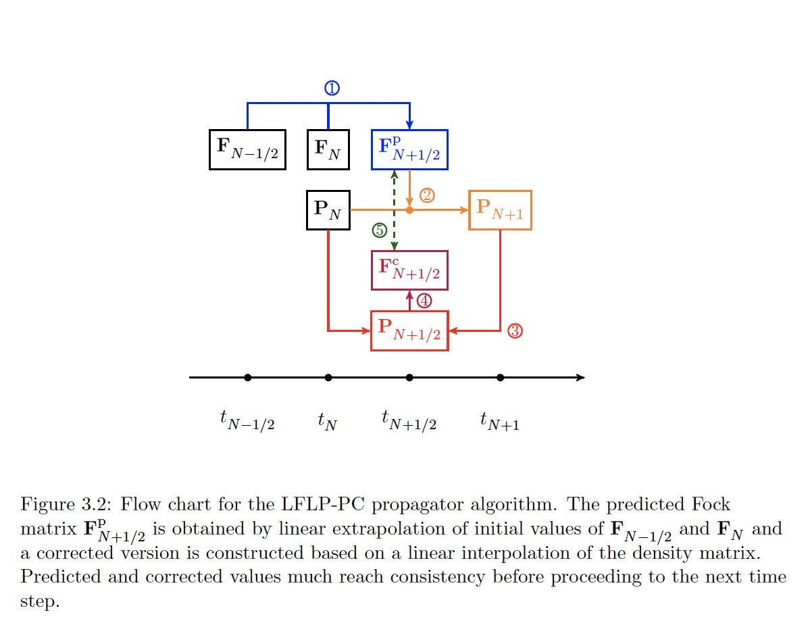
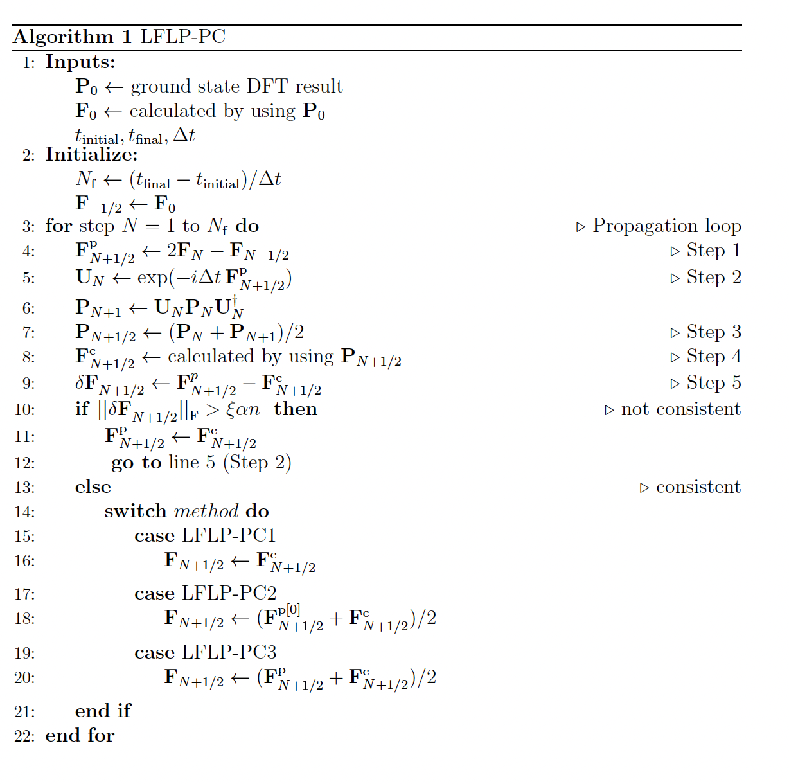
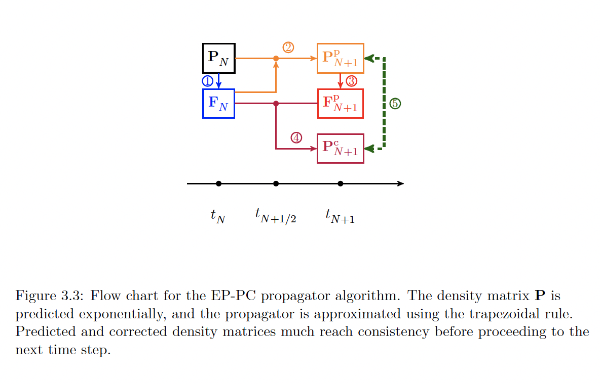
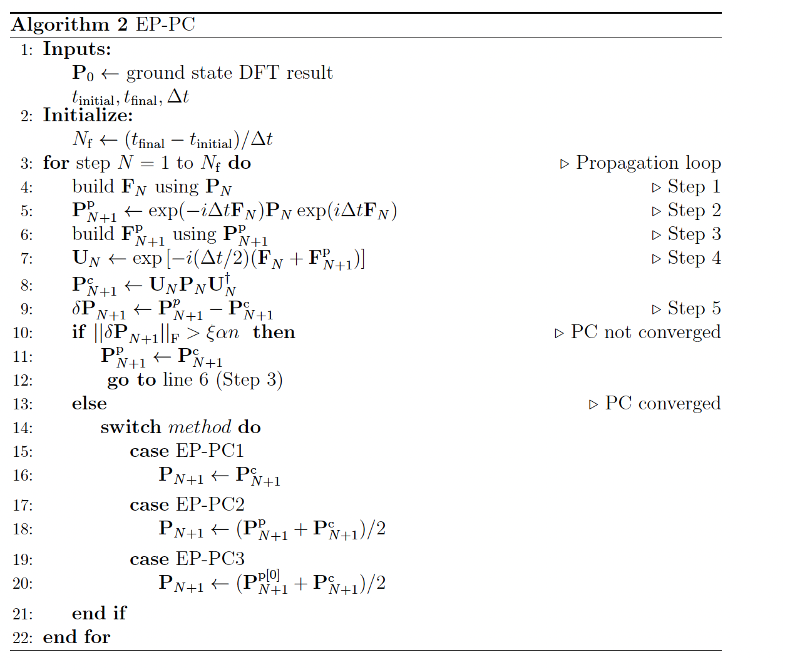
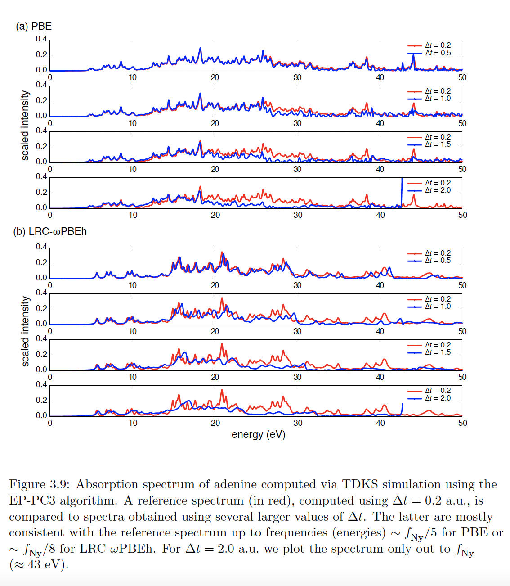

# quantum-algorithm-project
New algorithms to improve efficiency and stability for the time-propagated quantum simulation
The algorithms are for the time-propatation of the time-dependent Kohn-Sham equation (TDKS) 
which is used in the real-time time-dependent functional theory calculation (RT-TDDFT). 
<h3>algorithm 1</h3>

<h3>algorithm 2</h3>

<h3>Sample: improvement in spectrum calculation</h3>

